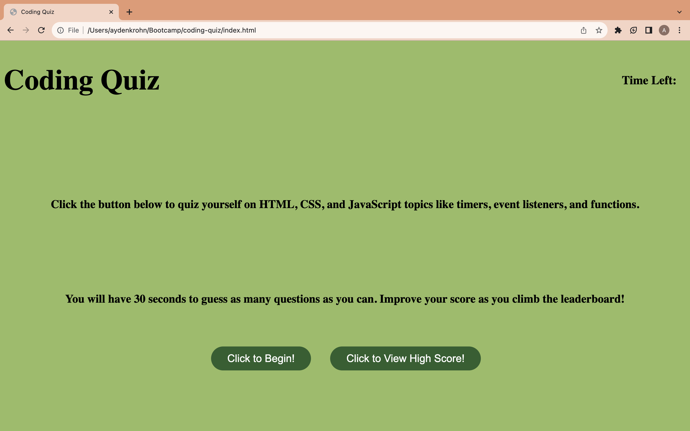
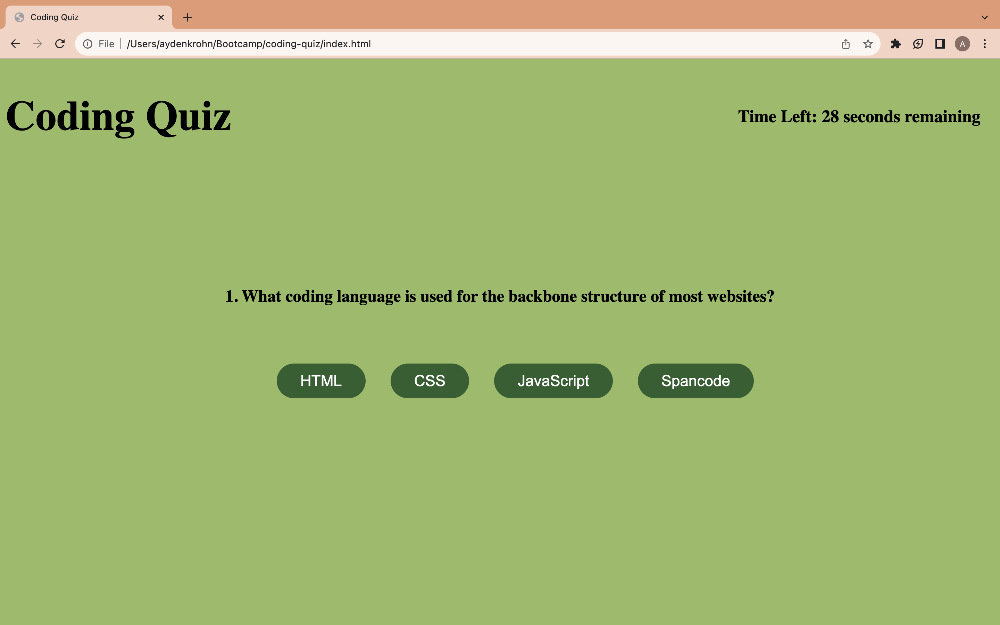
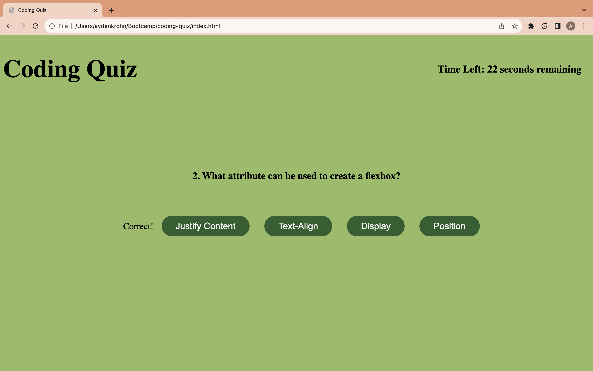
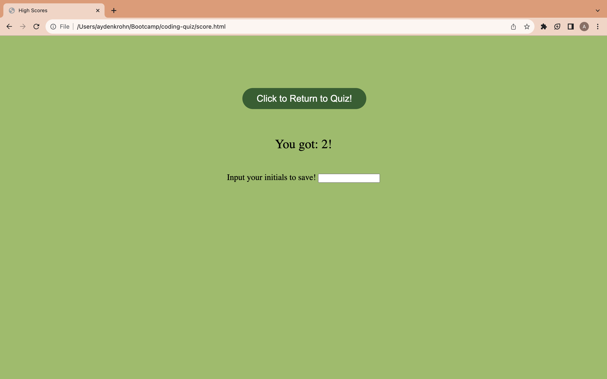

# Coding Quiz

## Description

My website provides a fun quiz about coding that automatically runs based on user input. This website solves the gives the user a website to study coding topics. The coding quiz is a timed quiz that can be modified easily. For example, you can add any number of questions or change the time for the quiz. 

## Installation
To open the quiz, open the URL provided in the usage section. You will be brought to the home screen with information about the quiz.

## Usage

Then, click on the button called, "Click to Begin!". This will automatically start the timer for the quiz and bring the first question to the screen. As you complete the quiz, you will be told whether you were correct or incorrect. If you are incorrect, 5 seconds will be deducted from the total time left. Once all questions are answered or time runs out, you will be brought to another page where your score will be displayed. There, you can view your score, input your initials, or click the "Return" button to start the quiz again.

Link to Deployed Application: https://krohnayden.github.io/coding-quiz/

Link to GitHub Repository: https://github.com/krohnayden/coding-quiz

## Credits
I followed tutorials from Mozilla and W3 schools.

Mozilla: https://developer.mozilla.org/en-US/docs/Web/JavaScript

W3 Schools: https://www.w3schools.com/js/default.asp

## License
N/A
